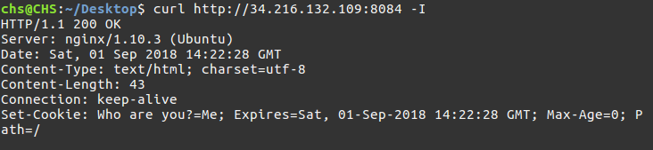
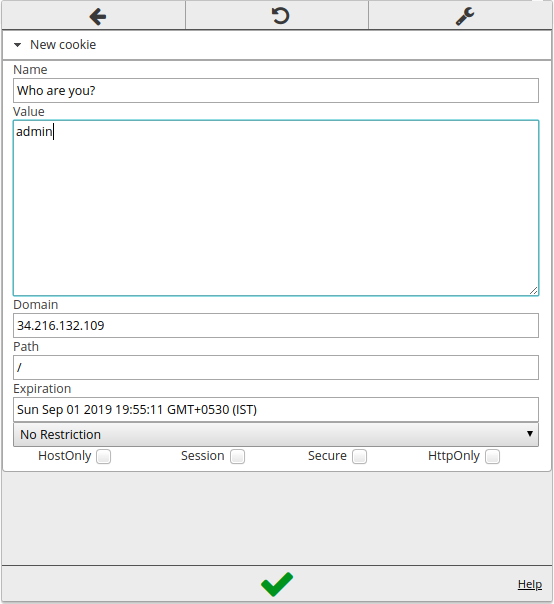

# Fortune Cookie

If you check there's nothing in the site.

So let's try curling

```bash
curl http://34.216.132.109:8084 -I
```

gives us :



we can see the set-cookie : who are you?Me

so set a cookie named "Who are you?" with value admin and reload the page.



we can see the flag : CodefestCTF{f0r7Un4B1sC0TtO}  
