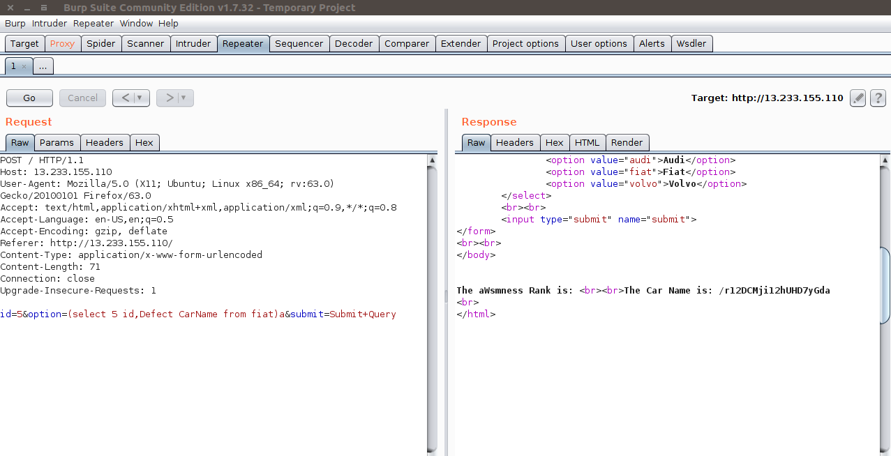

# S3cur3 cars

First thing is to intercept the request made by the page and inject in the option field : (select 5 id,Defect CarName from fiat)a

then you can see a page /r12DCMji12hUHD7yGda as a result of your injection in the carname field navigate to that page and check the source of that page to get the flag
